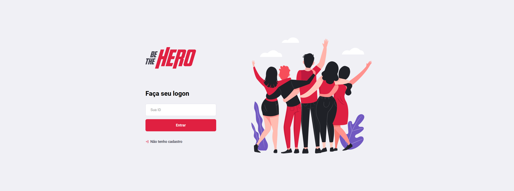
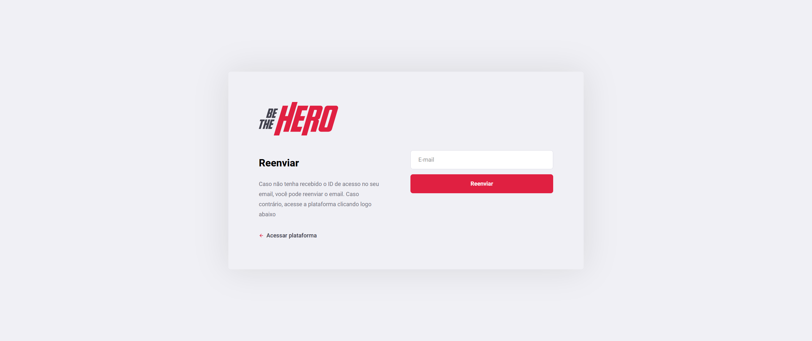
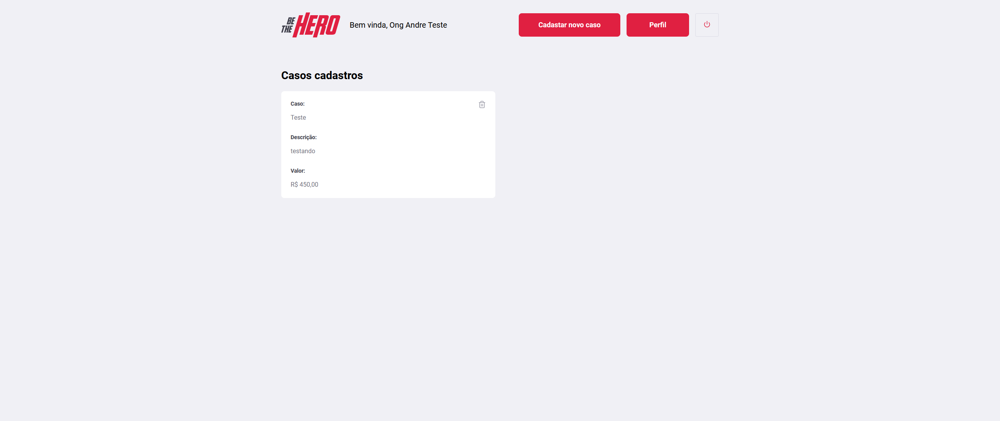
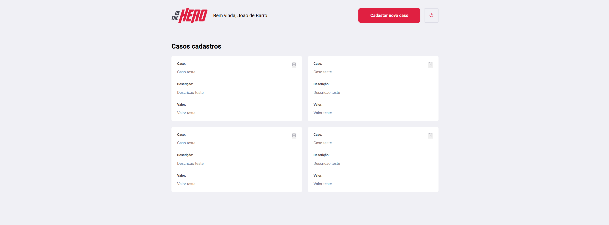
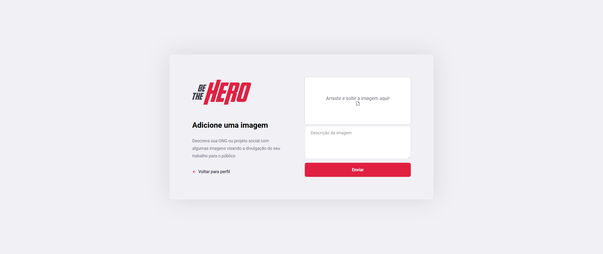

<h1 align="center">
Be supportive: Incentive a colaboração!
</h1>
<h2 align="center">
:computer: Desktop Preview :computer:
</h2>  

  
  
  
  
  
  

  

  
	
  

  

  

  

  <a href="#rocket-Technologies">Technologies</a>&nbsp;&nbsp;&nbsp;|&nbsp;&nbsp;&nbsp;
  <a href="#-project">Project</a>&nbsp;&nbsp;&nbsp;|&nbsp;&nbsp;&nbsp;
  <a href="#-layout">Layout</a>&nbsp;&nbsp;&nbsp;|&nbsp;&nbsp;&nbsp;
  <a href="#-how-to-contribute">How to contribute</a>&nbsp;&nbsp;&nbsp;|&nbsp;&nbsp;&nbsp;
  <a href="#memo-license">License</a>

 

## 🚀 Deploy

This project is live on Netlify, to access go to 

https://besupportive.netlify.app/

## 💻 Technologies

This project was developed with the following technologies:

- [Node.js](https://nodejs.org/en/) 
- [ReactJS](https://reactjs.org)

## 🎯 Project

en-es 
This project is inspired on "Be The Hero" who was developed during Omnistack week given by Rocketseat, that aims to connect people who are willing to help NOGs. This project comes to facilitate the contact of people interested in helping NGO cases, where we have NGOs on the one hand providing cases that need help and on the other hand people taking cases and helping in some way (money, food).

pt-br 
Este projeto é inspirado em "Be The Hero", onde foi desenvolvido na semana Omnistack 11 dada pela Rocketseat, onde o objetivo é conectar pessoas que gostariam de ajudar as ONGs de sua cidade. Este projeto vem para facilitar o contato de pessoas interessadas em ajudar casos de ONGs, onde temos por um lado a ONG disponibilizando os casos que precisam de ajuda e do outro lado pessoas pegando casos e ajudando de alguma forma (dinheiro, mantimentos etc).

## 🤔 How to contribute

- Make a fork;
- Create a branck with your feature: `git checkout -b my-feature`;
- Commit changes: `git commit -m 'feat: My new feature'`;
- Make a push to your branch: `git push origin my-feature`.

After merging your receipt request to done, you can delete a branch from yours.

## :memo: License

This project is under the MIT license. See the [LICENSE](LICENSE.md) for details.

---

Made by André Macena 🔥 [Get in touch!](https://www.linkedin.com/in/andr%C3%A9-macena-15275b12b/)